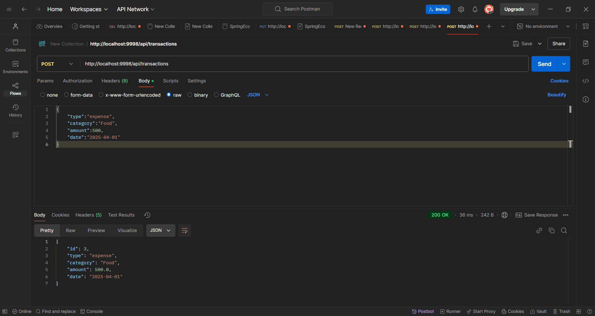
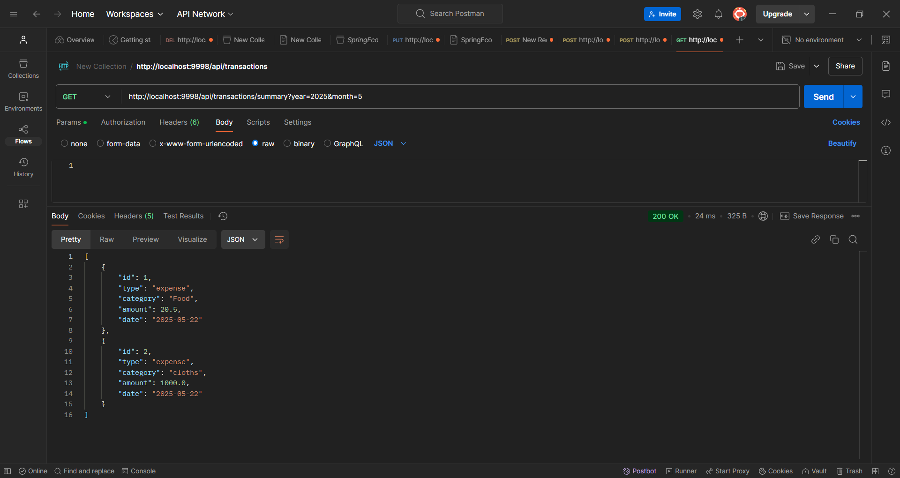
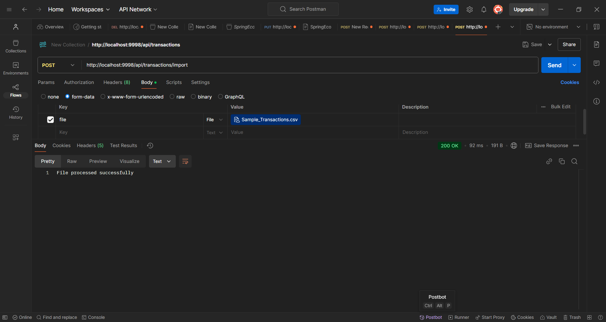

# Expense Tracker Application

## Description
This is a Spring Boot-based Expense Tracker application that allows users to manage their income and expenses with CRUD APIs and summary features. The project includes CSV import/export functionality and supports querying transactions by date.

## Features
- Add, update, delete transactions
- Get monthly transaction summary
- Import/Export transactions as CSV
- RESTful APIs using Spring Boot

API Endpoints
GET /api/transactions - Get all transactions

POST /api/transactions - Add new transaction

PUT /api/transactions/{id} - Update transaction

DELETE /api/transactions/{id} - Delete transaction

GET /api/transactions/summary?year=YYYY&month=MM - Get summary by month
## Screenshots

### Home Page

### Transactions API Result

### Summary API Result

